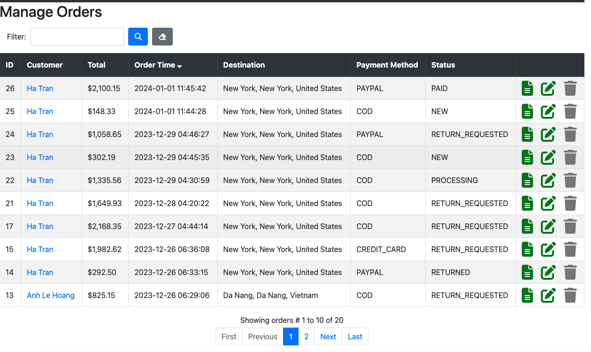

# TechMart: A full-stack ecommerce web application built with Java and Spring Framework

## Project Overview
This application uses Java, Spring Boot framework, Bootstrap, and MySQL database to build an electronics ecommerce website.

The application is deployed to Heroku at: [https://ecommerce-shop-app-23b4e9614907.herokuapp.com]

## Technologies
- Spring boot: 
  - Spring Data JPA and Hibernate framework to configure data access layer
  - Spring Security for authentication and authorization
  - Spring OAuth to help users log in with Google
  - Spring Mail to send confirmation emails to users
- MySQL: store app's data
- Paypal API (sandbox): handle payment from users
- JUnit, AssertJ, Mockito: unit test
- Bootstrap, HTML, JQuery: build frontend
- Amazon S3: store images from users and products

## Features

### Frontend

#### User Authentication
Users need to create an account and sign in in order to place orders. Users do not need an account to view product listings. Users can create an account and login with usernames and passwords or with Google. 

#### Product Listings
On the homepage, users can view all product categories. Users can click on a category to view all the products in that category. Users can click on a product to view its details including pictures, price and description. Users can change the quantity of the product they want to add to cart. Users can search for products using names, description, or brands.

  

#### Checkout Overview
In the checkout page, users can view all the checkout details for the chosen products. Users can view the total price and shipping cost calculated based on shipping address. Users can update the shipping address and view the expected delivery date. Users can pay with PayPal or choose cash-on-delivery (COD) option if their shipping address allows COD payment. 

#### Order Overview
In the orders page, users can view the list of their previous orders and their details such as product details, shipping information, and tracking information. 

### Backend

Only authorized role-based users can access the backend application. Admins have the right to manage everything including user information, product details, brand details, customer details, order details. Shippers can view products, view orders, and update order status. Salesperson can manage products and orders. Users can export data for users, categories, brands, products, and orders into CSV file. Users can filter data based on keywords such as names and ids. 

